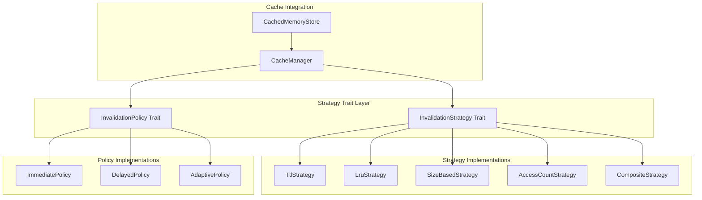

# Cache Invalidation Strategy Architecture

> **Navigation**: [Documentation Home](../README.md) > [Architecture](README.md) > Cache Invalidation

## Overview

This document describes the trait-based cache invalidation strategy system for Jamey's memory caching layer. The design extracts invalidation logic into reusable, composable components following the Strategy pattern.

## Current State Analysis

### Existing Implementation

The current implementation in [`jamey-core/src/cached_memory.rs`](../jamey-core/src/cached_memory.rs:286-303) has basic invalidation strategies:

```rust
pub enum InvalidationStrategy {
    Immediate,
    Delayed(Duration),
    Adaptive,
    Manual,
}
```

**Issues:**
1. Strategies are hardcoded enums, not extensible
2. No separation of concerns - invalidation logic mixed with cache operations
3. Limited strategy options (no TTL, LRU, size-based)
4. No composition or chaining of strategies
5. Difficult to test strategies in isolation

## Design Goals

1. **Extensibility**: Easy to add new invalidation strategies
2. **Composability**: Combine multiple strategies
3. **Testability**: Test strategies independently
4. **Performance**: Minimal overhead for strategy evaluation
5. **Configurability**: Runtime strategy selection and tuning

## Architecture

### Core Trait System



### Trait Definitions

#### InvalidationStrategy Trait

```rust
/// Core trait for cache invalidation strategies
#[async_trait]
pub trait InvalidationStrategy: Send + Sync + std::fmt::Debug {
    /// Determine if an entry should be invalidated
    async fn should_invalidate(&self, entry: &CacheEntry) -> Result<bool, CacheError>;
    
    /// Get strategy name for logging/metrics
    fn name(&self) -> &str;
    
    /// Get strategy configuration
    fn config(&self) -> StrategyConfig;
    
    /// Update strategy state after invalidation
    async fn on_invalidated(&mut self, entry: &CacheEntry) -> Result<(), CacheError>;
    
    /// Clone the strategy (for composition)
    fn clone_box(&self) -> Box<dyn InvalidationStrategy>;
}
```

#### InvalidationPolicy Trait

```rust
/// Policy for when/how to apply invalidation
#[async_trait]
pub trait InvalidationPolicy: Send + Sync + std::fmt::Debug {
    /// Execute invalidation with this policy
    async fn execute_invalidation<F>(
        &self,
        invalidate_fn: F,
        entry: &CacheEntry,
    ) -> Result<(), CacheError>
    where
        F: Future<Output = Result<(), CacheError>> + Send;
    
    /// Get policy name
    fn name(&self) -> &str;
}
```

#### CacheEntry Metadata

```rust
/// Metadata for cache entries used by strategies
#[derive(Debug, Clone)]
pub struct CacheEntry {
    pub key: String,
    pub size_bytes: usize,
    pub created_at: Instant,
    pub last_accessed: Instant,
    pub access_count: u64,
    pub ttl: Option<Duration>,
    pub priority: CachePriority,
    pub tags: Vec<String>,
}

#[derive(Debug, Clone, Copy, PartialEq, Eq, PartialOrd, Ord)]
pub enum CachePriority {
    Low = 0,
    Normal = 1,
    High = 2,
    Critical = 3,
}
```

## Strategy Implementations

### 1. TTL (Time-To-Live) Strategy

Invalidates entries after a specified duration.

```rust
#[derive(Debug, Clone)]
pub struct TtlStrategy {
    default_ttl: Duration,
    per_type_ttl: HashMap<String, Duration>,
}

impl TtlStrategy {
    pub fn new(default_ttl: Duration) -> Self {
        Self {
            default_ttl,
            per_type_ttl: HashMap::new(),
        }
    }
    
    pub fn with_type_ttl(mut self, type_name: &str, ttl: Duration) -> Self {
        self.per_type_ttl.insert(type_name.to_string(), ttl);
        self
    }
}

#[async_trait]
impl InvalidationStrategy for TtlStrategy {
    async fn should_invalidate(&self, entry: &CacheEntry) -> Result<bool, CacheError> {
        let ttl = entry.ttl
            .or_else(|| self.per_type_ttl.get(&entry.key).copied())
            .unwrap_or(self.default_ttl);
        
        let age = entry.created_at.elapsed();
        Ok(age >= ttl)
    }
    
    fn name(&self) -> &str {
        "ttl"
    }
    
    fn config(&self) -> StrategyConfig {
        StrategyConfig {
            name: self.name().to_string(),
            parameters: serde_json::json!({
                "default_ttl_seconds": self.default_ttl.as_secs(),
                "type_specific_ttls": self.per_type_ttl.iter()
                    .map(|(k, v)| (k.clone(), v.as_secs()))
                    .collect::<HashMap<_, _>>(),
            }),
        }
    }
    
    async fn on_invalidated(&mut self, _entry: &CacheEntry) -> Result<(), CacheError> {
        Ok(())
    }
    
    fn clone_box(&self) -> Box<dyn InvalidationStrategy> {
        Box::new(self.clone())
    }
}
```

### 2. LRU (Least Recently Used) Strategy

Invalidates least recently accessed entries when cache is full.

```rust
#[derive(Debug, Clone)]
pub struct LruStrategy {
    max_entries: usize,
    current_entries: Arc<AtomicUsize>,
}

impl LruStrategy {
    pub fn new(max_entries: usize) -> Self {
        Self {
            max_entries,
            current_entries: Arc::new(AtomicUsize::new(0)),
        }
    }
}

#[async_trait]
impl InvalidationStrategy for LruStrategy {
    async fn should_invalidate(&self, entry: &CacheEntry) -> Result<bool, CacheError> {
        let current = self.current_entries.load(Ordering::Relaxed);
        
        if current <= self.max_entries {
            return Ok(false);
        }
        
        // Invalidate if entry is old and has low access count
        let age = entry.last_accessed.elapsed();
        let is_stale = age > Duration::from_secs(300); // 5 minutes
        let is_rarely_used = entry.access_count < 5;
        
        Ok(is_stale && is_rarely_used)
    }
    
    fn name(&self) -> &str {
        "lru"
    }
    
    fn config(&self) -> StrategyConfig {
        StrategyConfig {
            name: self.name().to_string(),
            parameters: serde_json::json!({
                "max_entries": self.max_entries,
                "current_entries": self.current_entries.load(Ordering::Relaxed),
            }),
        }
    }
    
    async fn on_invalidated(&mut self, _entry: &CacheEntry) -> Result<(), CacheError> {
        self.current_entries.fetch_sub(1, Ordering::Relaxed);
        Ok(())
    }
    
    fn clone_box(&self) -> Box<dyn InvalidationStrategy> {
        Box::new(self.clone())
    }
}
```

### 3. Size-Based Strategy

Invalidates entries when total cache size exceeds threshold.

```rust
#[derive(Debug, Clone)]
pub struct SizeBasedStrategy {
    max_size_bytes: usize,
    current_size: Arc<AtomicUsize>,
    eviction_threshold: f64, // 0.0-1.0, when to start evicting
}

impl SizeBasedStrategy {
    pub fn new(max_size_bytes: usize) -> Self {
        Self {
            max_size_bytes,
            current_size: Arc::new(AtomicUsize::new(0)),
            eviction_threshold: 0.9, // Start evicting at 90% capacity
        }
    }
    
    pub fn with_threshold(mut self, threshold: f64) -> Self {
        self.eviction_threshold = threshold.clamp(0.0, 1.0);
        self
    }
}

#[async_trait]
impl InvalidationStrategy for SizeBasedStrategy {
    async fn should_invalidate(&self, entry: &CacheEntry) -> Result<bool, CacheError> {
        let current = self.current_size.load(Ordering::Relaxed);
        let threshold_bytes = (self.max_size_bytes as f64 * self.eviction_threshold) as usize;
        
        if current <= threshold_bytes {
            return Ok(false);
        }
        
        // Prioritize evicting large, low-priority entries
        let is_large = entry.size_bytes > 1024 * 100; // > 100KB
        let is_low_priority = entry.priority <= CachePriority::Normal;
        
        Ok(is_large && is_low_priority)
    }
    
    fn name(&self) -> &str {
        "size_based"
    }
    
    fn config(&self) -> StrategyConfig {
        StrategyConfig {
            name: self.name().to_string(),
            parameters: serde_json::json!({
                "max_size_bytes": self.max_size_bytes,
                "current_size_bytes": self.current_size.load(Ordering::Relaxed),
                "eviction_threshold": self.eviction_threshold,
            }),
        }
    }
    
    async fn on_invalidated(&mut self, entry: &CacheEntry) -> Result<(), CacheError> {
        self.current_size.fetch_sub(entry.size_bytes, Ordering::Relaxed);
        Ok(())
    }
    
    fn clone_box(&self) -> Box<dyn InvalidationStrategy> {
        Box::new(self.clone())
    }
}
```

### 4. Composite Strategy

Combines multiple strategies with AND/OR logic.

```rust
#[derive(Debug, Clone)]
pub enum CompositionMode {
    All,  // All strategies must agree (AND)
    Any,  // Any strategy can trigger (OR)
}

#[derive(Debug)]
pub struct CompositeStrategy {
    strategies: Vec<Box<dyn InvalidationStrategy>>,
    mode: CompositionMode,
}

impl CompositeStrategy {
    pub fn new(mode: CompositionMode) -> Self {
        Self {
            strategies: Vec::new(),
            mode,
        }
    }
    
    pub fn add_strategy(mut self, strategy: Box<dyn InvalidationStrategy>) -> Self {
        self.strategies.push(strategy);
        self
    }
}

#[async_trait]
impl InvalidationStrategy for CompositeStrategy {
    async fn should_invalidate(&self, entry: &CacheEntry) -> Result<bool, CacheError> {
        match self.mode {
            CompositionMode::All => {
                for strategy in &self.strategies {
                    if !strategy.should_invalidate(entry).await? {
                        return Ok(false);
                    }
                }
                Ok(true)
            }
            CompositionMode::Any => {
                for strategy in &self.strategies {
                    if strategy.should_invalidate(entry).await? {
                        return Ok(true);
                    }
                }
                Ok(false)
            }
        }
    }
    
    fn name(&self) -> &str {
        "composite"
    }
    
    fn config(&self) -> StrategyConfig {
        StrategyConfig {
            name: self.name().to_string(),
            parameters: serde_json::json!({
                "mode": format!("{:?}", self.mode),
                "strategies": self.strategies.iter()
                    .map(|s| s.config())
                    .collect::<Vec<_>>(),
            }),
        }
    }
    
    async fn on_invalidated(&mut self, entry: &CacheEntry) -> Result<(), CacheError> {
        for strategy in &mut self.strategies {
            strategy.on_invalidated(entry).await?;
        }
        Ok(())
    }
    
    fn clone_box(&self) -> Box<dyn InvalidationStrategy> {
        Box::new(CompositeStrategy {
            strategies: self.strategies.iter().map(|s| s.clone_box()).collect(),
            mode: self.mode.clone(),
        })
    }
}
```

## Policy Implementations

### Immediate Policy

Executes invalidation synchronously.

```rust
#[derive(Debug, Clone)]
pub struct ImmediatePolicy;

#[async_trait]
impl InvalidationPolicy for ImmediatePolicy {
    async fn execute_invalidation<F>(
        &self,
        invalidate_fn: F,
        _entry: &CacheEntry,
    ) -> Result<(), CacheError>
    where
        F: Future<Output = Result<(), CacheError>> + Send,
    {
        invalidate_fn.await
    }
    
    fn name(&self) -> &str {
        "immediate"
    }
}
```

### Delayed Policy

Executes invalidation after a delay.

```rust
#[derive(Debug, Clone)]
pub struct DelayedPolicy {
    delay: Duration,
}

impl DelayedPolicy {
    pub fn new(delay: Duration) -> Self {
        Self { delay }
    }
}

#[async_trait]
impl InvalidationPolicy for DelayedPolicy {
    async fn execute_invalidation<F>(
        &self,
        invalidate_fn: F,
        entry: &CacheEntry,
    ) -> Result<(), CacheError>
    where
        F: Future<Output = Result<(), CacheError>> + Send,
    {
        let delay = self.delay;
        let entry_key = entry.key.clone();
        
        tokio::spawn(async move {
            tokio::time::sleep(delay).await;
            if let Err(e) = invalidate_fn.await {
                tracing::warn!(
                    key = %entry_key,
                    error = %e,
                    "Delayed invalidation failed"
                );
            }
        });
        
        Ok(())
    }
    
    fn name(&self) -> &str {
        "delayed"
    }
}
```

### Adaptive Policy

Adjusts invalidation timing based on access patterns.

```rust
#[derive(Debug, Clone)]
pub struct AdaptivePolicy {
    high_access_threshold: u64,
    immediate_delay: Duration,
    deferred_delay: Duration,
}

impl AdaptivePolicy {
    pub fn new() -> Self {
        Self {
            high_access_threshold: 10,
            immediate_delay: Duration::from_millis(100),
            deferred_delay: Duration::from_secs(5),
        }
    }
}

#[async_trait]
impl InvalidationPolicy for AdaptivePolicy {
    async fn execute_invalidation<F>(
        &self,
        invalidate_fn: F,
        entry: &CacheEntry,
    ) -> Result<(), CacheError>
    where
        F: Future<Output = Result<(), CacheError>> + Send,
    {
        let delay = if entry.access_count >= self.high_access_threshold {
            // Frequently accessed - update immediately
            self.immediate_delay
        } else {
            // Rarely accessed - defer invalidation
            self.deferred_delay
        };
        
        let entry_key = entry.key.clone();
        tokio::spawn(async move {
            tokio::time::sleep(delay).await;
            if let Err(e) = invalidate_fn.await {
                tracing::warn!(
                    key = %entry_key,
                    error = %e,
                    "Adaptive invalidation failed"
                );
            }
        });
        
        Ok(())
    }
    
    fn name(&self) -> &str {
        "adaptive"
    }
}
```

## Integration with CacheManager

### Updated CacheManager

```rust
pub struct CacheManager {
    cache: HybridCache,
    config: CacheConfig,
    strategy: Box<dyn InvalidationStrategy>,
    policy: Box<dyn InvalidationPolicy>,
    metrics: CacheMetrics,
}

impl CacheManager {
    pub fn new(
        config: CacheConfig,
        strategy: Box<dyn InvalidationStrategy>,
        policy: Box<dyn InvalidationPolicy>,
    ) -> Result<Self, CacheError> {
        // ... initialization
    }
    
    pub async fn should_invalidate(&self, key: &str) -> Result<bool, CacheError> {
        let entry = self.get_entry_metadata(key).await?;
        self.strategy.should_invalidate(&entry).await
    }
    
    pub async fn invalidate_with_policy(&mut self, key: &str) -> Result<(), CacheError> {
        let entry = self.get_entry_metadata(key).await?;
        
        let cache = self.cache.clone();
        let key = key.to_string();
        
        self.policy.execute_invalidation(
            async move {
                cache.delete(&key).await?;
                Ok(())
            },
            &entry,
        ).await?;
        
        self.strategy.on_invalidated(&entry).await?;
        self.metrics.record_invalidation(&entry);
        
        Ok(())
    }
}
```

## Configuration

### Strategy Configuration

```rust
#[derive(Debug, Clone, Serialize, Deserialize)]
pub struct InvalidationConfig {
    pub strategy: StrategyType,
    pub policy: PolicyType,
    pub ttl_seconds: Option<u64>,
    pub max_entries: Option<usize>,
    pub max_size_bytes: Option<usize>,
    pub composite_mode: Option<CompositionMode>,
}

#[derive(Debug, Clone, Serialize, Deserialize)]
#[serde(rename_all = "snake_case")]
pub enum StrategyType {
    Ttl,
    Lru,
    SizeBased,
    Composite(Vec<StrategyType>),
}

#[derive(Debug, Clone, Serialize, Deserialize)]
#[serde(rename_all = "snake_case")]
pub enum PolicyType {
    Immediate,
    Delayed { delay_seconds: u64 },
    Adaptive,
}
```

### Environment Variables

```bash
# Cache invalidation strategy
CACHE_INVALIDATION_STRATEGY=composite  # ttl, lru, size_based, composite
CACHE_INVALIDATION_POLICY=adaptive     # immediate, delayed, adaptive

# TTL strategy settings
CACHE_TTL_DEFAULT_SECONDS=3600
CACHE_TTL_MEMORY_SECONDS=1800
CACHE_TTL_SEARCH_SECONDS=300

# LRU strategy settings
CACHE_LRU_MAX_ENTRIES=10000

# Size-based strategy settings
CACHE_SIZE_MAX_BYTES=1073741824  # 1GB
CACHE_SIZE_EVICTION_THRESHOLD=0.9

# Composite strategy
CACHE_COMPOSITE_MODE=any  # all, any
CACHE_COMPOSITE_STRATEGIES=ttl,lru,size_based
```

## Usage Examples

### Example 1: Simple TTL Strategy

```rust
let strategy = Box::new(
    TtlStrategy::new(Duration::from_secs(3600))
        .with_type_ttl("memory", Duration::from_secs(1800))
        .with_type_ttl("search", Duration::from_secs(300))
);

let policy = Box::new(ImmediatePolicy);

let cache_manager = CacheManager::new(config, strategy, policy)?;
```

### Example 2: Composite Strategy with Adaptive Policy

```rust
let composite = Box::new(
    CompositeStrategy::new(CompositionMode::Any)
        .add_strategy(Box::new(TtlStrategy::new(Duration::from_secs(3600))))
        .add_strategy(Box::new(LruStrategy::new(10000)))
        .add_strategy(Box::new(SizeBasedStrategy::new(1024 * 1024 * 1024)))
);

let policy = Box::new(AdaptivePolicy::new());

let cache_manager = CacheManager::new(config, composite, policy)?;
```

### Example 3: Custom Strategy

```rust
#[derive(Debug, Clone)]
struct PriorityBasedStrategy {
    min_priority: CachePriority,
}

#[async_trait]
impl InvalidationStrategy for PriorityBasedStrategy {
    async fn should_invalidate(&self, entry: &CacheEntry) -> Result<bool, CacheError> {
        Ok(entry.priority < self.min_priority)
    }
    
    // ... implement other methods
}
```

## Testing Strategy

### Unit Tests

```rust
#[cfg(test)]
mod tests {
    use super::*;
    
    #[tokio::test]
    async fn test_ttl_strategy_invalidates_expired() {
        let strategy = TtlStrategy::new(Duration::from_secs(1));
        
        let entry = CacheEntry {
            created_at: Instant::now() - Duration::from_secs(2),
            // ... other fields
        };
        
        assert!(strategy.should_invalidate(&entry).await.unwrap());
    }
    
    #[tokio::test]
    async fn test_composite_strategy_any_mode() {
        let composite = CompositeStrategy::new(CompositionMode::Any)
            .add_strategy(Box::new(TtlStrategy::new(Duration::from_secs(1))))
            .add_strategy(Box::new(LruStrategy::new(100)));
        
        // Test that any strategy can trigger invalidation
    }
}
```

## Performance Considerations

1. **Strategy Evaluation**: O(1) for simple strategies, O(n) for composite
2. **Memory Overhead**: Minimal - strategies store configuration only
3. **Async Overhead**: Negligible for most strategies
4. **Lock Contention**: Atomic operations for counters, no locks needed

## Migration Path

1. **Phase 1**: Implement new trait system alongside existing code
2. **Phase 2**: Add configuration support for new strategies
3. **Phase 3**: Migrate CacheManager to use new system
4. **Phase 4**: Deprecate old InvalidationStrategy enum
5. **Phase 5**: Remove old implementation

## Future Enhancements

1. **Machine Learning**: Predictive invalidation based on access patterns
2. **Cost-Based**: Invalidate based on regeneration cost
3. **Dependency Tracking**: Invalidate related entries
4. **Distributed Coordination**: Coordinate invalidation across nodes
5. **Metrics Integration**: Expose strategy metrics to Prometheus

## Related Documentation

- [System Overview](system-overview.md) - Overall architecture
- [Configuration Architecture](configuration.md) - Configuration system
- [ADR 001: Cache Invalidation Strategies](../adr/001-cache-invalidation-strategies.md) - Design decision
- [Performance Monitoring](../operations/performance-monitoring.md) - Performance metrics

## References

- [Cache Invalidation Patterns](https://martinfowler.com/bliki/TwoHardThings.html)
- [LRU Cache Implementation](https://en.wikipedia.org/wiki/Cache_replacement_policies#Least_recently_used_(LRU))
- [TTL Best Practices](https://redis.io/docs/manual/keyspace-notifications/)

---

**Last Updated**: 2025-11-17
**Status**: 📝 Design Complete
**Category**: Architecture