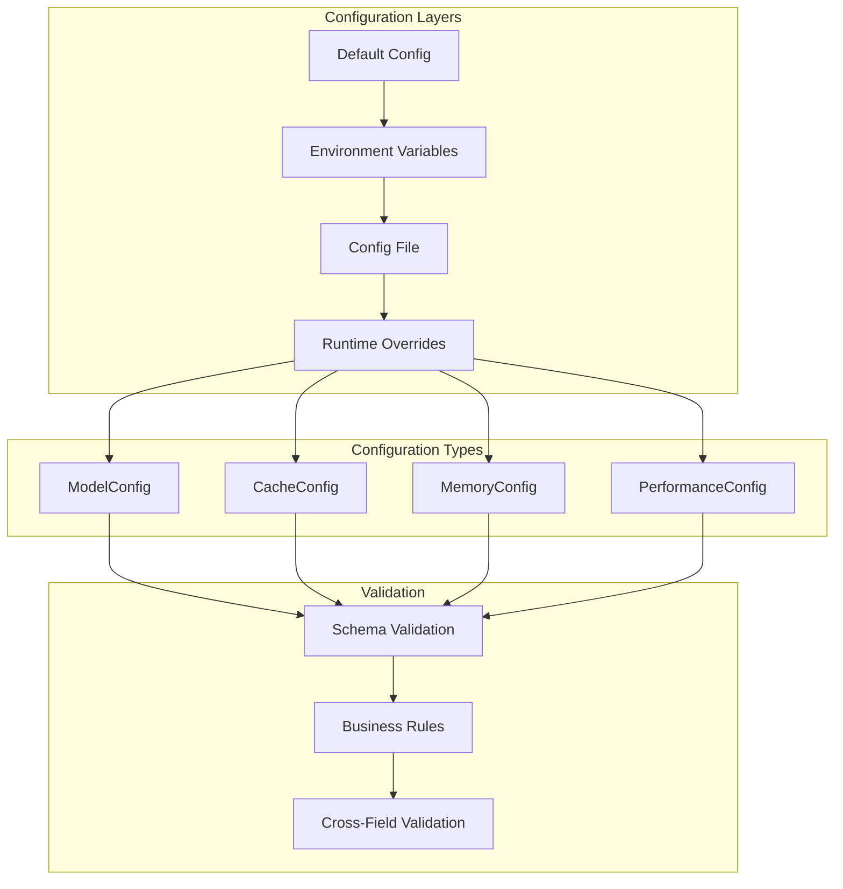

# Granular Configuration Architecture

> **Navigation**: [Documentation Home](../README.md) > [Architecture](README.md) > Configuration

## Overview

This document describes the granular configuration system for Jamey, addressing the issue of hardcoded values (embedding sizes, cache settings, etc.) throughout the codebase. The design provides per-model configuration, runtime adjustability, and comprehensive validation.

## Current State Analysis

### Hardcoded Values Found

1. **Embedding Dimensions**: Hardcoded to 1536 in multiple places
   - [`jamey-core/src/memory.rs:149`](../jamey-core/src/memory.rs:149): `embedding vector(1536)`
   - [`jamey-core/src/cached_memory.rs:48`](../jamey-core/src/cached_memory.rs:48): `vec![0.0; 1536]`
   - [`jamey-runtime/src/config.rs:76`](../jamey-runtime/src/config.rs:76): `fn default_vector_dimension() -> usize { 1536 }`

2. **Cache Settings**: Fixed TTL and capacity values
   - Default TTL: 3600 seconds
   - Memory capacity: 1000 entries
   - Search result TTL: 300 seconds

3. **Model Configuration**: Single model configuration
   - No per-model embedding sizes
   - No model-specific cache strategies
   - No runtime model switching

### Problems

1. **Inflexibility**: Cannot support multiple embedding models
2. **Maintenance**: Changes require code modifications
3. **Testing**: Difficult to test with different configurations
4. **Scalability**: Cannot optimize per-model settings

## Design Goals

1. **Per-Model Configuration**: Different settings per embedding model
2. **Runtime Adjustability**: Change settings without recompilation
3. **Type Safety**: Compile-time validation where possible
4. **Backward Compatibility**: Existing code continues to work
5. **Validation**: Comprehensive configuration validation
6. **Documentation**: Self-documenting configuration

## Architecture

### Configuration Hierarchy



## Core Configuration Types

### 1. Model Configuration

```rust
/// Configuration for embedding models
#[derive(Debug, Clone, Serialize, Deserialize, Validate)]
pub struct ModelConfig {
    /// Model identifier (e.g., "text-embedding-ada-002")
    #[validate(length(min = 1, max = 128))]
    pub model_id: String,
    
    /// Embedding dimension for this model
    #[validate(range(min = 1, max = 8192))]
    pub embedding_dimension: usize,
    
    /// Maximum input tokens
    #[validate(range(min = 1, max = 1000000))]
    pub max_input_tokens: usize,
    
    /// Model-specific cache configuration
    pub cache_config: Option<ModelCacheConfig>,
    
    /// Cost per 1K tokens (for budgeting)
    pub cost_per_1k_tokens: Option<f64>,
    
    /// Model capabilities
    pub capabilities: ModelCapabilities,
}

#[derive(Debug, Clone, Serialize, Deserialize)]
pub struct ModelCapabilities {
    pub supports_batch: bool,
    pub supports_streaming: bool,
    pub max_batch_size: usize,
}

#[derive(Debug, Clone, Serialize, Deserialize, Validate)]
pub struct ModelCacheConfig {
    /// TTL for embeddings from this model
    #[validate(range(min = 60, max = 86400))]
    pub embedding_ttl_seconds: u64,
    
    /// Cache priority for this model's embeddings
    pub cache_priority: CachePriority,
    
    /// Whether to cache embeddings from this model
    pub enable_caching: bool,
}
```

### 2. Enhanced Cache Configuration

```rust
/// Granular cache configuration
#[derive(Debug, Clone, Serialize, Deserialize, Validate)]
pub struct GranularCacheConfig {
    /// Redis connection URL
    pub redis_url: Option<String>,
    
    /// Key prefix for cache entries
    #[validate(length(min = 1, max = 64))]
    pub key_prefix: String,
    
    /// In-memory cache capacity
    #[validate(range(min = 10, max = 1000000))]
    pub memory_capacity: usize,
    
    /// Default TTL for cache entries
    #[validate(range(min = 60, max = 86400))]
    pub default_ttl_seconds: u64,
    
    /// Per-type TTL overrides
    pub type_ttls: HashMap<String, u64>,
    
    /// Maximum cache size in bytes
    #[validate(range(min = 1048576, max = 10737418240))] // 1MB - 10GB
    pub max_size_bytes: Option<usize>,
    
    /// Invalidation strategy configuration
    pub invalidation: InvalidationConfig,
    
    /// Enable fallback to memory cache
    pub enable_fallback: bool,
    
    /// Cache warming configuration
    pub warming: Option<CacheWarmingConfig>,
}

#[derive(Debug, Clone, Serialize, Deserialize)]
pub struct CacheWarmingConfig {
    pub enabled: bool,
    pub on_startup: bool,
    pub warm_count: usize,
    pub warm_interval_seconds: u64,
}
```

### 3. Memory Configuration

```rust
/// Enhanced memory configuration
#[derive(Debug, Clone, Serialize, Deserialize, Validate)]
pub struct GranularMemoryConfig {
    /// PostgreSQL connection settings
    pub postgres: PostgresConfig,
    
    /// Per-model vector configurations
    pub models: HashMap<String, ModelConfig>,
    
    /// Default model to use
    #[validate(length(min = 1, max = 128))]
    pub default_model: String,
    
    /// Vector index configuration
    pub vector_index: VectorIndexConfig,
    
    /// Memory retention policies
    pub retention: RetentionConfig,
    
    /// Search configuration
    pub search: SearchConfig,
}

#[derive(Debug, Clone, Serialize, Deserialize, Validate)]
pub struct VectorIndexConfig {
    /// Index type: ivfflat, hnsw
    #[validate(custom(function = "validate_index_type"))]
    pub index_type: String,
    
    /// Number of lists for IVFFlat
    #[validate(range(min = 10, max = 10000))]
    pub lists: Option<usize>,
    
    /// M parameter for HNSW
    #[validate(range(min = 4, max = 64))]
    pub m: Option<usize>,
    
    /// ef_construction for HNSW
    #[validate(range(min = 8, max = 512))]
    pub ef_construction: Option<usize>,
    
    /// Rebuild threshold (% of entries changed)
    #[validate(range(min = 0.0, max = 1.0))]
    pub rebuild_threshold: f64,
}

#[derive(Debug, Clone, Serialize, Deserialize, Validate)]
pub struct RetentionConfig {
    /// Maximum age of memories in days
    #[validate(range(min = 1, max = 3650))]
    pub max_age_days: u32,
    
    /// Maximum number of memories
    #[validate(range(min = 100, max = 10000000))]
    pub max_entries: usize,
    
    /// Cleanup interval in hours
    #[validate(range(min = 1, max = 168))]
    pub cleanup_interval_hours: u32,
    
    /// Per-type retention overrides
    pub type_retention: HashMap<String, u32>,
}

#[derive(Debug, Clone, Serialize, Deserialize, Validate)]
pub struct SearchConfig {
    /// Default search limit
    #[validate(range(min = 1, max = 1000))]
    pub default_limit: usize,
    
    /// Maximum search limit
    #[validate(range(min = 1, max = 10000))]
    pub max_limit: usize,
    
    /// Similarity threshold
    #[validate(range(min = 0.0, max = 1.0))]
    pub similarity_threshold: f32,
    
    /// Enable result caching
    pub cache_results: bool,
    
    /// Result cache TTL
    #[validate(range(min = 60, max = 3600))]
    pub result_cache_ttl_seconds: u64,
}
```

### 4. Performance Configuration

```rust
/// Runtime performance tuning
#[derive(Debug, Clone, Serialize, Deserialize, Validate)]
pub struct PerformanceConfig {
    /// Connection pool settings
    pub pool: PoolConfig,
    
    /// Batch processing settings
    pub batch: BatchConfig,
    
    /// Timeout settings
    pub timeouts: TimeoutConfig,
    
    /// Rate limiting
    pub rate_limits: RateLimitConfig,
}

#[derive(Debug, Clone, Serialize, Deserialize, Validate)]
pub struct PoolConfig {
    #[validate(range(min = 1, max = 100))]
    pub min_connections: u32,
    
    #[validate(range(min = 1, max = 1000))]
    pub max_connections: u32,
    
    #[validate(range(min = 1, max = 300))]
    pub connection_timeout_seconds: u64,
    
    #[validate(range(min = 60, max = 3600))]
    pub idle_timeout_seconds: u64,
}

#[derive(Debug, Clone, Serialize, Deserialize, Validate)]
pub struct BatchConfig {
    #[validate(range(min = 1, max = 1000))]
    pub max_batch_size: usize,
    
    #[validate(range(min = 10, max = 10000))]
    pub batch_timeout_ms: u64,
    
    pub enable_auto_batching: bool,
}

#[derive(Debug, Clone, Serialize, Deserialize, Validate)]
pub struct TimeoutConfig {
    #[validate(range(min = 1, max = 300))]
    pub query_timeout_seconds: u64,
    
    #[validate(range(min = 1, max = 600))]
    pub embedding_timeout_seconds: u64,
    
    #[validate(range(min = 1, max = 60))]
    pub cache_timeout_seconds: u64,
}

#[derive(Debug, Clone, Serialize, Deserialize, Validate)]
pub struct RateLimitConfig {
    pub enabled: bool,
    
    #[validate(range(min = 1, max = 10000))]
    pub requests_per_minute: u32,
    
    #[validate(range(min = 1, max = 1000))]
    pub burst_size: u32,
}
```

## Configuration Loading

### Configuration Manager

```rust
/// Central configuration manager
pub struct ConfigManager {
    config: Arc<RwLock<RuntimeConfig>>,
    validators: Vec<Box<dyn ConfigValidator>>,
    watchers: Vec<Box<dyn ConfigWatcher>>,
}

impl ConfigManager {
    /// Load configuration from multiple sources
    pub async fn load() -> Result<Self, ConfigError> {
        let mut builder = ConfigBuilder::new();
        
        // Layer 1: Defaults
        builder.add_source(DefaultConfig::new());
        
        // Layer 2: Config file
        if let Ok(path) = env::var("CONFIG_FILE") {
            builder.add_source(FileConfig::new(&path)?);
        }
        
        // Layer 3: Environment variables
        builder.add_source(EnvConfig::new("JAMEY_")?);
        
        // Layer 4: Runtime overrides (from database/API)
        if let Ok(overrides) = RuntimeOverrides::load().await {
            builder.add_source(overrides);
        }
        
        let config = builder.build()?;
        
        // Validate configuration
        let validators = Self::create_validators();
        for validator in &validators {
            validator.validate(&config)?;
        }
        
        Ok(Self {
            config: Arc::new(RwLock::new(config)),
            validators,
            watchers: Vec::new(),
        })
    }
    
    /// Get configuration snapshot
    pub async fn get(&self) -> RuntimeConfig {
        self.config.read().await.clone()
    }
    
    /// Update configuration at runtime
    pub async fn update<F>(&self, updater: F) -> Result<(), ConfigError>
    where
        F: FnOnce(&mut RuntimeConfig),
    {
        let mut config = self.config.write().await;
        updater(&mut config);
        
        // Validate updated configuration
        for validator in &self.validators {
            validator.validate(&config)?;
        }
        
        // Notify watchers
        for watcher in &self.watchers {
            watcher.on_config_changed(&config).await?;
        }
        
        Ok(())
    }
    
    /// Get model-specific configuration
    pub async fn get_model_config(&self, model_id: &str) -> Result<ModelConfig, ConfigError> {
        let config = self.config.read().await;
        config.memory.models
            .get(model_id)
            .cloned()
            .ok_or_else(|| ConfigError::ModelNotFound(model_id.to_string()))
    }
    
    /// Register configuration watcher
    pub fn watch<W: ConfigWatcher + 'static>(&mut self, watcher: W) {
        self.watchers.push(Box::new(watcher));
    }
}
```

### Configuration Validation

```rust
/// Configuration validator trait
#[async_trait]
pub trait ConfigValidator: Send + Sync {
    async fn validate(&self, config: &RuntimeConfig) -> Result<(), ConfigError>;
    fn name(&self) -> &str;
}

/// Schema validator (using validator crate)
pub struct SchemaValidator;

#[async_trait]
impl ConfigValidator for SchemaValidator {
    async fn validate(&self, config: &RuntimeConfig) -> Result<(), ConfigError> {
        config.validate()
            .map_err(|e| ConfigError::ValidationFailed(e.to_string()))
    }
    
    fn name(&self) -> &str {
        "schema"
    }
}

/// Business rules validator
pub struct BusinessRulesValidator;

#[async_trait]
impl ConfigValidator for BusinessRulesValidator {
    async fn validate(&self, config: &RuntimeConfig) -> Result<(), ConfigError> {
        // Validate model references
        let default_model = &config.memory.default_model;
        if !config.memory.models.contains_key(default_model) {
            return Err(ConfigError::InvalidValue(
                format!("Default model '{}' not found in models", default_model)
            ));
        }
        
        // Validate cache size vs memory capacity
        if let Some(max_size) = config.cache.max_size_bytes {
            let estimated_entry_size = 10 * 1024; // 10KB average
            let max_entries_by_size = max_size / estimated_entry_size;
            if config.cache.memory_capacity > max_entries_by_size {
                tracing::warn!(
                    "Memory capacity ({}) may exceed max size ({})",
                    config.cache.memory_capacity,
                    max_entries_by_size
                );
            }
        }
        
        // Validate pool connections
        if config.performance.pool.min_connections > config.performance.pool.max_connections {
            return Err(ConfigError::InvalidValue(
                "min_connections cannot exceed max_connections".to_string()
            ));
        }
        
        Ok(())
    }
    
    fn name(&self) -> &str {
        "business_rules"
    }
}

/// Cross-field validator
pub struct CrossFieldValidator;

#[async_trait]
impl ConfigValidator for CrossFieldValidator {
    async fn validate(&self, config: &RuntimeConfig) -> Result<(), ConfigError> {
        // Validate embedding dimensions match across models
        for (model_id, model_config) in &config.memory.models {
            if model_config.embedding_dimension == 0 {
                return Err(ConfigError::InvalidValue(
                    format!("Model '{}' has zero embedding dimension", model_id)
                ));
            }
        }
        
        // Validate TTL relationships
        if config.cache.default_ttl_seconds < 60 {
            return Err(ConfigError::InvalidValue(
                "Default TTL too short (minimum 60 seconds)".to_string()
            ));
        }
        
        Ok(())
    }
    
    fn name(&self) -> &str {
        "cross_field"
    }
}
```

## Configuration File Format

### TOML Example

```toml
[project]
name = "jamey"
environment = "production"

[memory]
default_model = "text-embedding-ada-002"

[memory.postgres]
host = "localhost"
port = 5432
database = "jamey"
user = "jamey"
max_connections = 20

[memory.vector_index]
index_type = "hnsw"
m = 16
ef_construction = 200
rebuild_threshold = 0.1

[memory.retention]
max_age_days = 90
max_entries = 1000000
cleanup_interval_hours = 24

[memory.search]
default_limit = 10
max_limit = 100
similarity_threshold = 0.8
cache_results = true
result_cache_ttl_seconds = 300

# Model configurations
[[memory.models]]
model_id = "text-embedding-ada-002"
embedding_dimension = 1536
max_input_tokens = 8191
cost_per_1k_tokens = 0.0001

[memory.models.cache_config]
embedding_ttl_seconds = 3600
cache_priority = "high"
enable_caching = true

[memory.models.capabilities]
supports_batch = true
supports_streaming = false
max_batch_size = 100

[[memory.models]]
model_id = "text-embedding-3-large"
embedding_dimension = 3072
max_input_tokens = 8191
cost_per_1k_tokens = 0.00013

[cache]
redis_url = "redis://localhost:6379"
key_prefix = "jamey"
memory_capacity = 10000
default_ttl_seconds = 3600
max_size_bytes = 1073741824  # 1GB
enable_fallback = true

[cache.type_ttls]
memory = 1800
search = 300
embedding = 7200

[cache.invalidation]
strategy = "composite"
policy = "adaptive"
composite_mode = "any"

[cache.warming]
enabled = true
on_startup = true
warm_count = 1000
warm_interval_seconds = 3600

[performance.pool]
min_connections = 5
max_connections = 50
connection_timeout_seconds = 30
idle_timeout_seconds = 600

[performance.batch]
max_batch_size = 100
batch_timeout_ms = 1000
enable_auto_batching = true

[performance.timeouts]
query_timeout_seconds = 30
embedding_timeout_seconds = 60
cache_timeout_seconds = 5

[performance.rate_limits]
enabled = true
requests_per_minute = 1000
burst_size = 100
```

## Environment Variables

```bash
# Override specific settings
JAMEY_MEMORY__DEFAULT_MODEL=text-embedding-3-large
JAMEY_CACHE__MEMORY_CAPACITY=20000
JAMEY_PERFORMANCE__POOL__MAX_CONNECTIONS=100

# Model-specific overrides
JAMEY_MEMORY__MODELS__TEXT_EMBEDDING_ADA_002__EMBEDDING_DIMENSION=1536
JAMEY_MEMORY__MODELS__TEXT_EMBEDDING_3_LARGE__EMBEDDING_DIMENSION=3072
```

## Runtime Configuration Updates

### Configuration API

```rust
/// API for runtime configuration updates
pub struct ConfigApi {
    manager: Arc<ConfigManager>,
}

impl ConfigApi {
    /// Update cache capacity
    pub async fn update_cache_capacity(&self, capacity: usize) -> Result<(), ConfigError> {
        self.manager.update(|config| {
            config.cache.memory_capacity = capacity;
        }).await
    }
    
    /// Add or update model configuration
    pub async fn upsert_model(&self, model: ModelConfig) -> Result<(), ConfigError> {
        self.manager.update(|config| {
            config.memory.models.insert(model.model_id.clone(), model);
        }).await
    }
    
    /// Update invalidation strategy
    pub async fn update_invalidation_strategy(
        &self,
        strategy: InvalidationConfig,
    ) -> Result<(), ConfigError> {
        self.manager.update(|config| {
            config.cache.invalidation = strategy;
        }).await
    }
}
```

## Migration Strategy

### Phase 1: Add Configuration Types
- Define new configuration structs
- Add validation framework
- Create configuration manager

### Phase 2: Update Existing Code
- Replace hardcoded values with config lookups
- Add model-specific logic
- Update tests

### Phase 3: Configuration File Support
- Add TOML/YAML parsing
- Environment variable overrides
- Documentation

### Phase 4: Runtime Updates
- Configuration API
- Hot reload support
- Monitoring integration

## Testing Strategy

```rust
#[cfg(test)]
mod tests {
    use super::*;
    
    #[tokio::test]
    async fn test_config_validation() {
        let mut config = RuntimeConfig::default();
        config.memory.default_model = "nonexistent".to_string();
        
        let validator = BusinessRulesValidator;
        assert!(validator.validate(&config).await.is_err());
    }
    
    #[tokio::test]
    async fn test_model_config_lookup() {
        let manager = ConfigManager::load().await.unwrap();
        let model = manager.get_model_config("text-embedding-ada-002").await.unwrap();
        assert_eq!(model.embedding_dimension, 1536);
    }
    
    #[tokio::test]
    async fn test_runtime_update() {
        let manager = ConfigManager::load().await.unwrap();
        manager.update(|config| {
            config.cache.memory_capacity = 5000;
        }).await.unwrap();
        
        let config = manager.get().await;
        assert_eq!(config.cache.memory_capacity, 5000);
    }
}
```

## Performance Considerations

1. **Configuration Access**: Use Arc<RwLock> for concurrent access
2. **Validation**: Cache validation results when possible
3. **Updates**: Batch updates to minimize lock contention
4. **Watchers**: Async notification to prevent blocking

## Future Enhancements

1. **Dynamic Model Loading**: Load models from external registry
2. **A/B Testing**: Support multiple configuration profiles
3. **Cost Optimization**: Automatic model selection based on cost/performance
4. **Configuration Versioning**: Track configuration changes over time
5. **Remote Configuration**: Load from distributed config service

## Related Documentation

- [System Overview](system-overview.md) - Overall architecture
- [Cache Invalidation](cache-invalidation.md) - Cache strategy system
- [Improvements Summary](improvements-summary.md) - Implementation roadmap
- [Performance Monitoring](../operations/performance-monitoring.md) - Performance tuning

## References

- [12-Factor App Configuration](https://12factor.net/config)
- [Rust Config Crate](https://docs.rs/config/)
- [Validator Crate](https://docs.rs/validator/)

---

**Last Updated**: 2025-11-17
**Status**: 📝 Design Complete
**Category**: Architecture