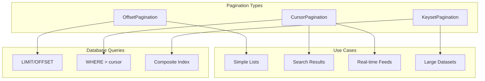

# Pagination Architecture

> **Navigation**: [Documentation Home](../README.md) > [Architecture](README.md) > Pagination

## Overview

This document describes the pagination system for Jamey's search results and memory listings. The design supports both offset-based and cursor-based pagination with efficient database queries and proper result ordering.

## Current State Analysis

### Existing Implementation

Current pagination in [`jamey-core/src/memory.rs:405`](../jamey-core/src/memory.rs:405):

```rust
async fn list_paginated(&self, limit: usize, offset: usize) -> Result<(Vec<Memory>, i64)>
```

**Issues:**
1. Only offset-based pagination (inefficient for large offsets)
2. No cursor-based pagination for stable iteration
3. Limited ordering options
4. No pagination metadata (has_more, next_cursor, etc.)
5. Potential performance issues with large datasets
6. No support for filtering during pagination

## Design Goals

1. **Efficiency**: Optimal database queries for both small and large datasets
2. **Stability**: Consistent results during iteration
3. **Flexibility**: Support multiple pagination strategies
4. **Metadata**: Rich pagination information for clients
5. **Filtering**: Combine pagination with search/filter criteria
6. **Type Safety**: Compile-time guarantees where possible

## Architecture

### Pagination Strategies



## Core Types

### Pagination Request

```rust
/// Pagination request parameters
#[derive(Debug, Clone, Serialize, Deserialize, Validate)]
pub struct PaginationRequest {
    /// Pagination strategy
    pub strategy: PaginationStrategy,
    
    /// Number of items per page
    #[validate(range(min = 1, max = 1000))]
    pub limit: usize,
    
    /// Ordering criteria
    pub order: Vec<OrderBy>,
    
    /// Optional filters
    pub filters: Option<FilterCriteria>,
}

#[derive(Debug, Clone, Serialize, Deserialize)]
#[serde(tag = "type", rename_all = "snake_case")]
pub enum PaginationStrategy {
    /// Offset-based pagination (page numbers)
    Offset {
        offset: usize,
    },
    
    /// Cursor-based pagination (opaque cursor)
    Cursor {
        cursor: Option<String>,
    },
    
    /// Keyset pagination (last seen values)
    Keyset {
        last_id: Option<Uuid>,
        last_value: Option<serde_json::Value>,
    },
}

#[derive(Debug, Clone, Serialize, Deserialize)]
pub struct OrderBy {
    pub field: String,
    pub direction: OrderDirection,
}

#[derive(Debug, Clone, Copy, Serialize, Deserialize)]
#[serde(rename_all = "lowercase")]
pub enum OrderDirection {
    Asc,
    Desc,
}

#[derive(Debug, Clone, Serialize, Deserialize)]
pub struct FilterCriteria {
    pub memory_type: Option<MemoryType>,
    pub created_after: Option<DateTime<Utc>>,
    pub created_before: Option<DateTime<Utc>>,
    pub min_similarity: Option<f32>,
    pub tags: Option<Vec<String>>,
}
```

### Pagination Response

```rust
/// Pagination response with metadata
#[derive(Debug, Clone, Serialize, Deserialize)]
pub struct PaginationResponse<T> {
    /// The data items for this page
    pub items: Vec<T>,
    
    /// Pagination metadata
    pub metadata: PaginationMetadata,
}

#[derive(Debug, Clone, Serialize, Deserialize)]
pub struct PaginationMetadata {
    /// Total number of items (if available)
    pub total_count: Option<i64>,
    
    /// Number of items in this page
    pub page_size: usize,
    
    /// Whether there are more items
    pub has_more: bool,
    
    /// Cursor for next page (if applicable)
    pub next_cursor: Option<String>,
    
    /// Cursor for previous page (if applicable)
    pub prev_cursor: Option<String>,
    
    /// Current page number (for offset pagination)
    pub current_page: Option<usize>,
    
    /// Total pages (for offset pagination, if total known)
    pub total_pages: Option<usize>,
}
```

## Pagination Implementations

### 1. Offset-Based Pagination

Best for: Simple lists, known page numbers, small to medium datasets

```rust
/// Offset-based paginator
pub struct OffsetPaginator {
    pool: Pool,
}

impl OffsetPaginator {
    pub async fn paginate(
        &self,
        request: PaginationRequest,
    ) -> Result<PaginationResponse<Memory>, MemoryError> {
        let PaginationStrategy::Offset { offset } = request.strategy else {
            return Err(MemoryError::InvalidRequest("Expected offset strategy".to_string()));
        };
        
        let client = self.pool.get().await?;
        
        // Build query with filters
        let mut query = String::from("SELECT * FROM memories");
        let mut where_clauses = Vec::new();
        let mut params: Vec<Box<dyn tokio_postgres::types::ToSql + Sync>> = Vec::new();
        
        // Add filters
        if let Some(filters) = &request.filters {
            if let Some(memory_type) = &filters.memory_type {
                where_clauses.push(format!("memory_type = ${}", params.len() + 1));
                params.push(Box::new(memory_type.to_string()));
            }
            
            if let Some(created_after) = filters.created_after {
                where_clauses.push(format!("created_at >= ${}", params.len() + 1));
                params.push(Box::new(created_after));
            }
        }
        
        if !where_clauses.is_empty() {
            query.push_str(" WHERE ");
            query.push_str(&where_clauses.join(" AND "));
        }
        
        // Add ordering
        if !request.order.is_empty() {
            query.push_str(" ORDER BY ");
            let order_clauses: Vec<String> = request.order.iter()
                .map(|o| format!("{} {}", o.field, o.direction))
                .collect();
            query.push_str(&order_clauses.join(", "));
        } else {
            query.push_str(" ORDER BY created_at DESC");
        }
        
        // Add pagination
        query.push_str(&format!(" LIMIT ${} OFFSET ${}", params.len() + 1, params.len() + 2));
        params.push(Box::new(request.limit as i64 + 1)); // Fetch one extra to check has_more
        params.push(Box::new(offset as i64));
        
        // Execute query
        let param_refs: Vec<&(dyn tokio_postgres::types::ToSql + Sync)> = 
            params.iter().map(|p| p.as_ref()).collect();
        let rows = client.query(&query, &param_refs).await?;
        
        // Get total count (expensive, only if needed)
        let total_count = if offset == 0 {
            Some(self.get_total_count(&client, &request.filters).await?)
        } else {
            None
        };
        
        // Process results
        let has_more = rows.len() > request.limit;
        let items: Vec<Memory> = rows.into_iter()
            .take(request.limit)
            .map(|row| self.row_to_memory(row))
            .collect::<Result<Vec<_>, _>>()?;
        
        let current_page = offset / request.limit;
        let total_pages = total_count.map(|count| {
            ((count as usize + request.limit - 1) / request.limit)
        });
        
        Ok(PaginationResponse {
            items,
            metadata: PaginationMetadata {
                total_count,
                page_size: request.limit,
                has_more,
                next_cursor: None,
                prev_cursor: None,
                current_page: Some(current_page),
                total_pages,
            },
        })
    }
    
    async fn get_total_count(
        &self,
        client: &tokio_postgres::Client,
        filters: &Option<FilterCriteria>,
    ) -> Result<i64, MemoryError> {
        let mut query = String::from("SELECT COUNT(*) FROM memories");
        let mut where_clauses = Vec::new();
        let mut params: Vec<Box<dyn tokio_postgres::types::ToSql + Sync>> = Vec::new();
        
        // Add same filters as main query
        if let Some(filters) = filters {
            // ... same filter logic
        }
        
        if !where_clauses.is_empty() {
            query.push_str(" WHERE ");
            query.push_str(&where_clauses.join(" AND "));
        }
        
        let param_refs: Vec<&(dyn tokio_postgres::types::ToSql + Sync)> = 
            params.iter().map(|p| p.as_ref()).collect();
        let row = client.query_one(&query, &param_refs).await?;
        Ok(row.get(0))
    }
}
```

### 2. Cursor-Based Pagination

Best for: Real-time feeds, stable iteration, infinite scroll

```rust
/// Cursor-based paginator
pub struct CursorPaginator {
    pool: Pool,
}

impl CursorPaginator {
    pub async fn paginate(
        &self,
        request: PaginationRequest,
    ) -> Result<PaginationResponse<Memory>, MemoryError> {
        let PaginationStrategy::Cursor { cursor } = request.strategy else {
            return Err(MemoryError::InvalidRequest("Expected cursor strategy".to_string()));
        };
        
        let client = self.pool.get().await?;
        
        // Decode cursor if present
        let cursor_data = if let Some(cursor_str) = cursor {
            Some(self.decode_cursor(&cursor_str)?)
        } else {
            None
        };
        
        // Build query
        let mut query = String::from("SELECT * FROM memories");
        let mut where_clauses = Vec::new();
        let mut params: Vec<Box<dyn tokio_postgres::types::ToSql + Sync>> = Vec::new();
        
        // Add cursor condition
        if let Some(cursor) = cursor_data {
            where_clauses.push(format!(
                "(created_at, id) < (${}, ${})",
                params.len() + 1,
                params.len() + 2
            ));
            params.push(Box::new(cursor.created_at));
            params.push(Box::new(cursor.id));
        }
        
        // Add filters
        if let Some(filters) = &request.filters {
            // ... filter logic
        }
        
        if !where_clauses.is_empty() {
            query.push_str(" WHERE ");
            query.push_str(&where_clauses.join(" AND "));
        }
        
        // Order by created_at DESC, id DESC for stable sorting
        query.push_str(" ORDER BY created_at DESC, id DESC");
        
        // Fetch one extra to check has_more
        query.push_str(&format!(" LIMIT ${}", params.len() + 1));
        params.push(Box::new(request.limit as i64 + 1));
        
        // Execute query
        let param_refs: Vec<&(dyn tokio_postgres::types::ToSql + Sync)> = 
            params.iter().map(|p| p.as_ref()).collect();
        let rows = client.query(&query, &param_refs).await?;
        
        // Process results
        let has_more = rows.len() > request.limit;
        let items: Vec<Memory> = rows.into_iter()
            .take(request.limit)
            .map(|row| self.row_to_memory(row))
            .collect::<Result<Vec<_>, _>>()?;
        
        // Generate next cursor from last item
        let next_cursor = if has_more && !items.is_empty() {
            let last = items.last().unwrap();
            Some(self.encode_cursor(last.created_at, last.id)?)
        } else {
            None
        };
        
        Ok(PaginationResponse {
            items,
            metadata: PaginationMetadata {
                total_count: None, // Not available with cursor pagination
                page_size: request.limit,
                has_more,
                next_cursor,
                prev_cursor: None, // Could implement backward pagination
                current_page: None,
                total_pages: None,
            },
        })
    }
    
    fn encode_cursor(&self, created_at: DateTime<Utc>, id: Uuid) -> Result<String, MemoryError> {
        let cursor_data = CursorData { created_at, id };
        let json = serde_json::to_string(&cursor_data)?;
        Ok(base64::encode(json))
    }
    
    fn decode_cursor(&self, cursor: &str) -> Result<CursorData, MemoryError> {
        let json = base64::decode(cursor)
            .map_err(|e| MemoryError::InvalidRequest(format!("Invalid cursor: {}", e)))?;
        let cursor_data = serde_json::from_slice(&json)?;
        Ok(cursor_data)
    }
}

#[derive(Debug, Serialize, Deserialize)]
struct CursorData {
    created_at: DateTime<Utc>,
    id: Uuid,
}
```

### 3. Keyset Pagination

Best for: Large datasets, high performance requirements

```rust
/// Keyset paginator (most efficient for large datasets)
pub struct KeysetPaginator {
    pool: Pool,
}

impl KeysetPaginator {
    pub async fn paginate(
        &self,
        request: PaginationRequest,
    ) -> Result<PaginationResponse<Memory>, MemoryError> {
        let PaginationStrategy::Keyset { last_id, last_value } = request.strategy else {
            return Err(MemoryError::InvalidRequest("Expected keyset strategy".to_string()));
        };
        
        let client = self.pool.get().await?;
        
        // Determine sort column from order
        let sort_column = request.order.first()
            .map(|o| o.field.as_str())
            .unwrap_or("created_at");
        
        // Build query with keyset condition
        let mut query = String::from("SELECT * FROM memories");
        let mut where_clauses = Vec::new();
        let mut params: Vec<Box<dyn tokio_postgres::types::ToSql + Sync>> = Vec::new();
        
        // Add keyset condition for efficient pagination
        if let (Some(id), Some(value)) = (last_id, last_value) {
            // Use composite index (sort_column, id) for efficient seeking
            where_clauses.push(format!(
                "({}, id) > (${}, ${})",
                sort_column,
                params.len() + 1,
                params.len() + 2
            ));
            params.push(Box::new(value));
            params.push(Box::new(id));
        }
        
        // Add filters
        if let Some(filters) = &request.filters {
            // ... filter logic
        }
        
        if !where_clauses.is_empty() {
            query.push_str(" WHERE ");
            query.push_str(&where_clauses.join(" AND "));
        }
        
        // Add ordering
        query.push_str(&format!(" ORDER BY {} ASC, id ASC", sort_column));
        
        // Fetch one extra to check has_more
        query.push_str(&format!(" LIMIT ${}", params.len() + 1));
        params.push(Box::new(request.limit as i64 + 1));
        
        // Execute query
        let param_refs: Vec<&(dyn tokio_postgres::types::ToSql + Sync)> = 
            params.iter().map(|p| p.as_ref()).collect();
        let rows = client.query(&query, &param_refs).await?;
        
        // Process results
        let has_more = rows.len() > request.limit;
        let items: Vec<Memory> = rows.into_iter()
            .take(request.limit)
            .map(|row| self.row_to_memory(row))
            .collect::<Result<Vec<_>, _>>()?;
        
        Ok(PaginationResponse {
            items,
            metadata: PaginationMetadata {
                total_count: None,
                page_size: request.limit,
                has_more,
                next_cursor: None,
                prev_cursor: None,
                current_page: None,
                total_pages: None,
            },
        })
    }
}
```

## Search Result Pagination

### Vector Search with Pagination

```rust
/// Paginated vector search
pub async fn search_paginated(
    &self,
    query_embedding: &[f32],
    request: PaginationRequest,
) -> Result<PaginationResponse<Memory>, MemoryError> {
    let client = self.pool.get().await?;
    
    // Vector search with pagination
    let query = r#"
        SELECT *, embedding <=> $1::vector as distance
        FROM memories
        WHERE distance < $2
        ORDER BY distance ASC
        LIMIT $3 OFFSET $4
    "#;
    
    let PaginationStrategy::Offset { offset } = request.strategy else {
        return Err(MemoryError::InvalidRequest("Vector search requires offset pagination".to_string()));
    };
    
    let embedding_str = format!("[{}]",
        query_embedding.iter()
            .map(ToString::to_string)
            .collect::<Vec<_>>()
            .join(",")
    );
    
    let similarity_threshold = request.filters
        .as_ref()
        .and_then(|f| f.min_similarity)
        .unwrap_or(0.8);
    
    let rows = client.query(
        query,
        &[
            &embedding_str,
            &similarity_threshold,
            &(request.limit as i64 + 1),
            &(offset as i64),
        ],
    ).await?;
    
    let has_more = rows.len() > request.limit;
    let items: Vec<Memory> = rows.into_iter()
        .take(request.limit)
        .map(|row| self.row_to_memory(row))
        .collect::<Result<Vec<_>, _>>()?;
    
    Ok(PaginationResponse {
        items,
        metadata: PaginationMetadata {
            total_count: None,
            page_size: request.limit,
            has_more,
            next_cursor: None,
            prev_cursor: None,
            current_page: Some(offset / request.limit),
            total_pages: None,
        },
    })
}
```

## Database Optimization

### Required Indexes

```sql
-- Composite index for cursor pagination
CREATE INDEX idx_memories_created_id ON memories (created_at DESC, id DESC);

-- Composite index for keyset pagination
CREATE INDEX idx_memories_keyset ON memories (created_at ASC, id ASC);

-- Index for filtered pagination
CREATE INDEX idx_memories_type_created ON memories (memory_type, created_at DESC);

-- Vector similarity index (already exists)
CREATE INDEX memories_embedding_idx ON memories 
USING ivfflat (embedding vector_cosine_ops) WITH (lists = 100);
```

## Usage Examples

### Example 1: Simple Offset Pagination

```rust
let request = PaginationRequest {
    strategy: PaginationStrategy::Offset { offset: 0 },
    limit: 20,
    order: vec![OrderBy {
        field: "created_at".to_string(),
        direction: OrderDirection::Desc,
    }],
    filters: None,
};

let response = store.list_paginated(request).await?;
println!("Page 1: {} items, has more: {}", 
    response.items.len(), 
    response.metadata.has_more
);
```

### Example 2: Cursor-Based Infinite Scroll

```rust
let mut cursor = None;
loop {
    let request = PaginationRequest {
        strategy: PaginationStrategy::Cursor { cursor: cursor.clone() },
        limit: 50,
        order: vec![],
        filters: None,
    };
    
    let response = store.list_paginated(request).await?;
    
    // Process items
    for item in response.items {
        println!("Memory: {}", item.content);
    }
    
    if !response.metadata.has_more {
        break;
    }
    
    cursor = response.metadata.next_cursor;
}
```

### Example 3: Filtered Search with Pagination

```rust
let request = PaginationRequest {
    strategy: PaginationStrategy::Offset { offset: 0 },
    limit: 10,
    order: vec![OrderBy {
        field: "created_at".to_string(),
        direction: OrderDirection::Desc,
    }],
    filters: Some(FilterCriteria {
        memory_type: Some(MemoryType::Conversation),
        created_after: Some(Utc::now() - Duration::days(7)),
        created_before: None,
        min_similarity: None,
        tags: Some(vec!["important".to_string()]),
    }),
};

let response = store.list_paginated(request).await?;
```

## Performance Comparison

| Strategy | Small Dataset | Large Dataset | Stability | Complexity |
|----------|--------------|---------------|-----------|------------|
| Offset | O(n) | O(n + offset) | Low | Low |
| Cursor | O(n) | O(n) | High | Medium |
| Keyset | O(log n) | O(log n) | High | High |

## Best Practices

1. **Choose the Right Strategy**:
   - Offset: Simple lists, known page numbers
   - Cursor: Real-time feeds, stable iteration
   - Keyset: Large datasets, performance critical

2. **Index Optimization**:
   - Create composite indexes for sort columns
   - Monitor query performance
   - Use EXPLAIN ANALYZE

3. **Limit Validation**:
   - Enforce maximum page size
   - Prevent resource exhaustion
   - Consider rate limiting

4. **Caching**:
   - Cache first page results
   - Invalidate on writes
   - Use short TTLs

## Migration Path

1. **Phase 1**: Add new pagination types alongside existing
2. **Phase 2**: Update MemoryStore trait with new methods
3. **Phase 3**: Implement cursor and keyset paginators
4. **Phase 4**: Update API endpoints to support new pagination
5. **Phase 5**: Deprecate old pagination method

## Future Enhancements

1. **Bidirectional Cursors**: Support backward pagination
2. **Parallel Fetching**: Fetch multiple pages concurrently
3. **Smart Prefetching**: Predict and prefetch next pages
4. **Compression**: Compress large result sets
5. **Streaming**: Stream results for very large datasets

## Related Documentation

- [System Overview](system-overview.md) - Overall architecture
- [Cache Invalidation](cache-invalidation.md) - Cache strategy system
- [Performance Monitoring](../operations/performance-monitoring.md) - Performance optimization
- [Improvements Summary](improvements-summary.md) - Implementation roadmap

## References

- [Pagination Best Practices](https://www.citusdata.com/blog/2016/03/30/five-ways-to-paginate/)
- [Cursor vs Offset Pagination](https://slack.engineering/evolving-api-pagination-at-slack/)
- [PostgreSQL Performance](https://www.postgresql.org/docs/current/queries-limit.html)

---

**Last Updated**: 2025-11-17
**Status**: 📝 Design Complete
**Category**: Architecture