# Jamey 2.0 Architecture Overview

> **Navigation**: [Documentation Home](../README.md) > [Architecture](README.md) > System Overview

## Executive Summary

Jamey 2.0 is a sophisticated digital twin system built with Rust, featuring advanced memory management, caching, and AI integration. This document provides a comprehensive overview of the system architecture, component relationships, and data flow.

## System Architecture

### High-Level Component View

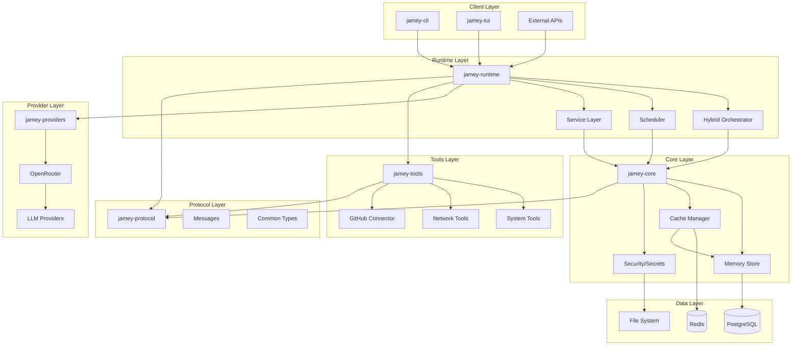

## Component Details

### 1. jamey-core

**Purpose**: Core functionality for memory, caching, and security

**Key Components**:
- **Memory Store**: PostgreSQL-backed vector memory with pgvector
- **Cache Manager**: Redis + in-memory hybrid caching
- **Secret Manager**: Secure credential storage using OS keychain
- **Profiling**: Performance monitoring and metrics

**Dependencies**:
```toml
tokio-postgres = "0.7"
deadpool-postgres = "0.10"
redis = "0.32"
pgvector = "0.3"
keyring = "2.0"
```

### 2. jamey-runtime

**Purpose**: Main runtime engine and orchestration

**Key Components**:
- **Hybrid Orchestrator**: Coordinates LLM and tool execution
- **Scheduler**: Manages periodic tasks and 24/7 operation
- **Service Layer**: HTTP/HTTPS API with TLS support
- **Configuration**: Environment-based configuration management

**Features**:
- mTLS support for secure communication
- HSTS and security headers
- Health checks and metrics endpoints
- Hot configuration reload

### 3. jamey-providers

**Purpose**: LLM provider integrations

**Supported Providers**:
- OpenRouter (primary)
- Direct model access (future)

**Features**:
- Retry logic with exponential backoff
- Rate limiting
- Cost tracking
- Model switching

### 4. jamey-tools

**Purpose**: System tools and external integrations

**Tool Categories**:
- **System Admin**: Process management, registry access
- **Network/Web**: HTTP requests, web scraping
- **GitHub**: Repository operations, issue management
- **LinkedIn**: Profile access (future)
- **MCP**: Model Context Protocol integration
- **Self-Improvement**: Code modification capabilities

### 5. jamey-protocol

**Purpose**: Shared types and message definitions

**Key Types**:
- Message structures (user, assistant, system)
- Tool call/result types
- Token usage tracking
- Session management

### 6. jamey-cli

**Purpose**: Command-line interface

**Commands**:
- `init`: Initialize configuration
- `chat`: Interactive chat sessions
- `memory`: Memory management
- `process`: Process control
- `system`: System information
- `start/stop/status`: Service control

### 7. jamey-tui

**Purpose**: Terminal user interface

**Features**:
- Real-time chat interface
- Message history
- Syntax highlighting
- Clipboard integration

## Data Flow

### Memory Storage Flow

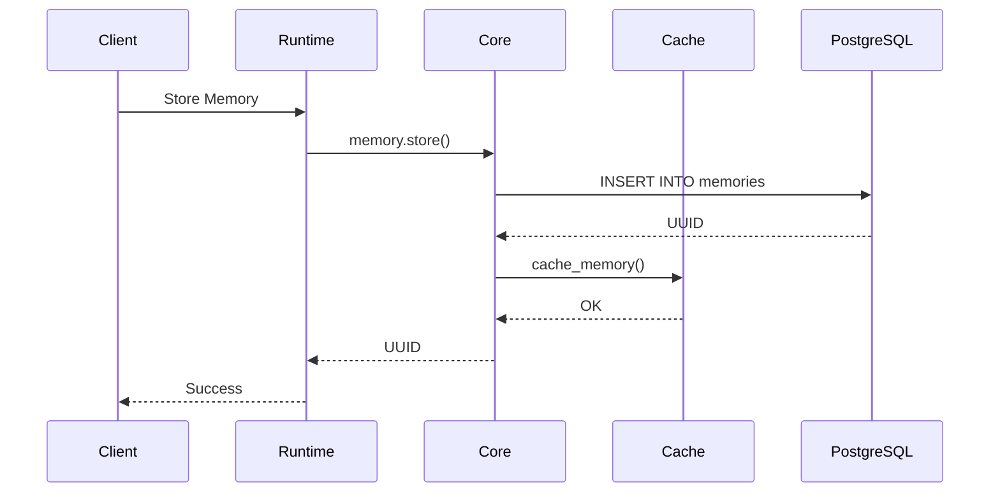

### Memory Retrieval Flow

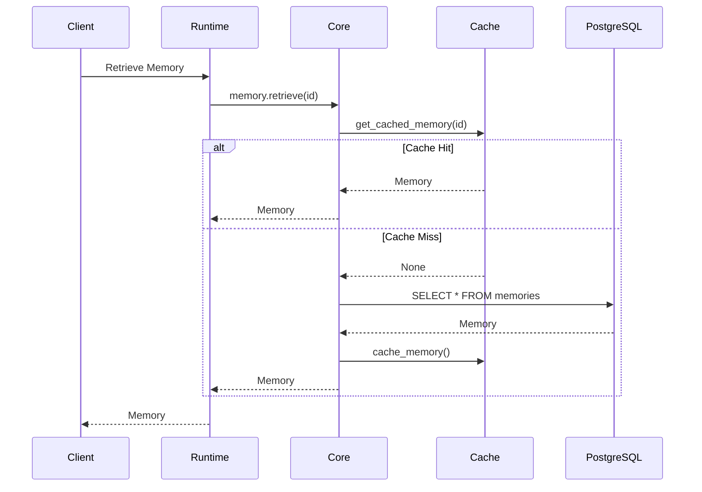

### Vector Search Flow

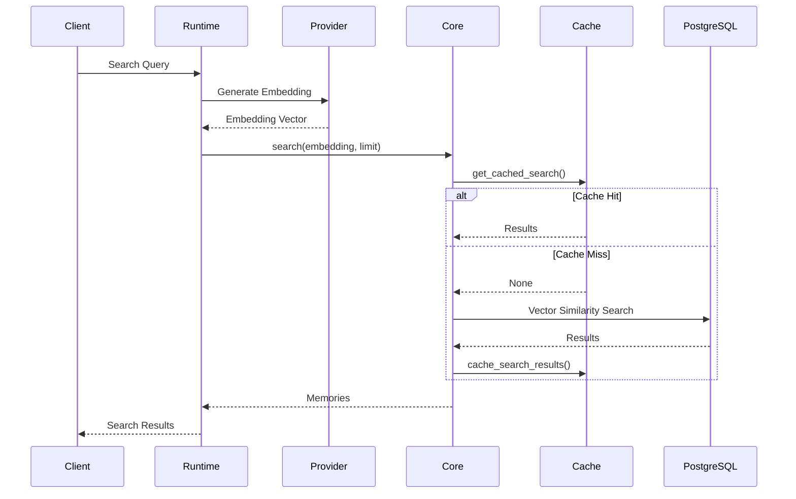

### LLM Processing Flow

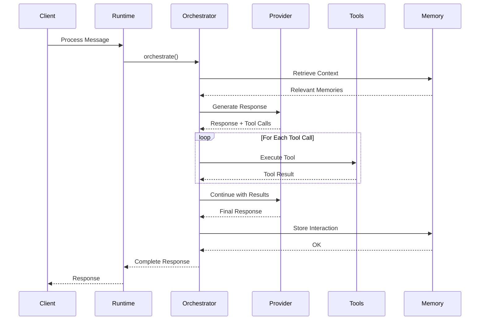

## Cache Architecture

### Cache Hierarchy

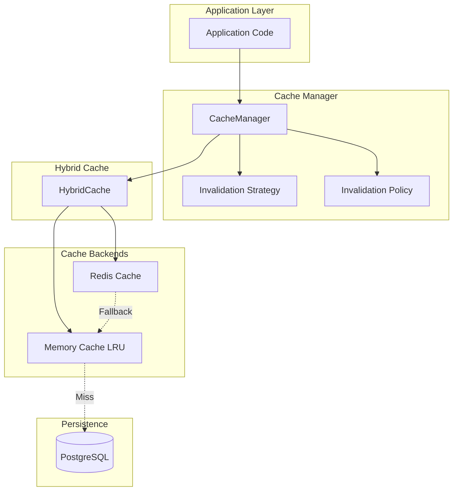

### Cache Invalidation Strategies

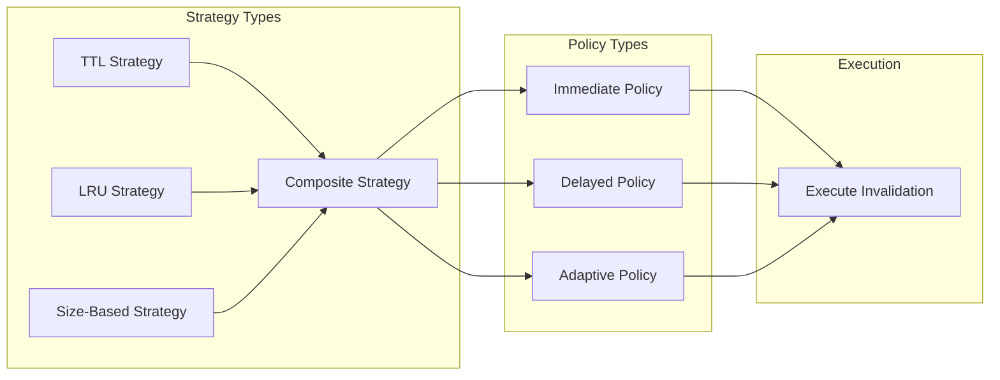

## Configuration System

### Configuration Hierarchy

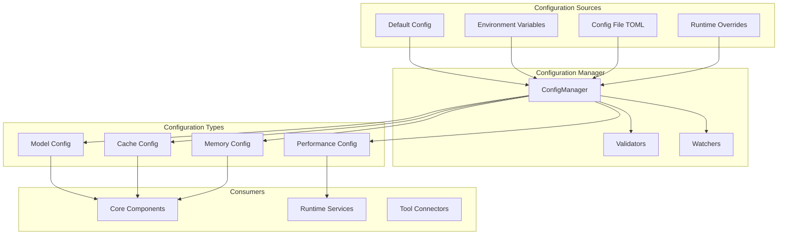

## Security Architecture

### Secret Management

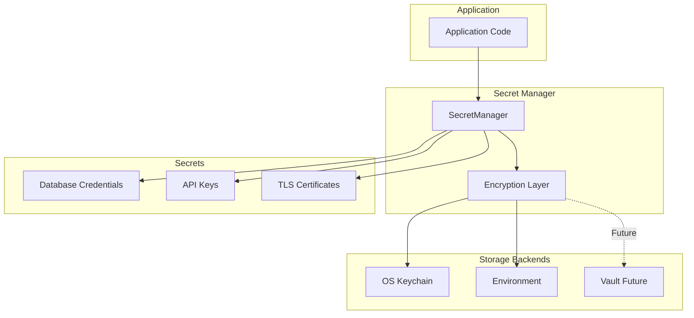

### TLS Configuration

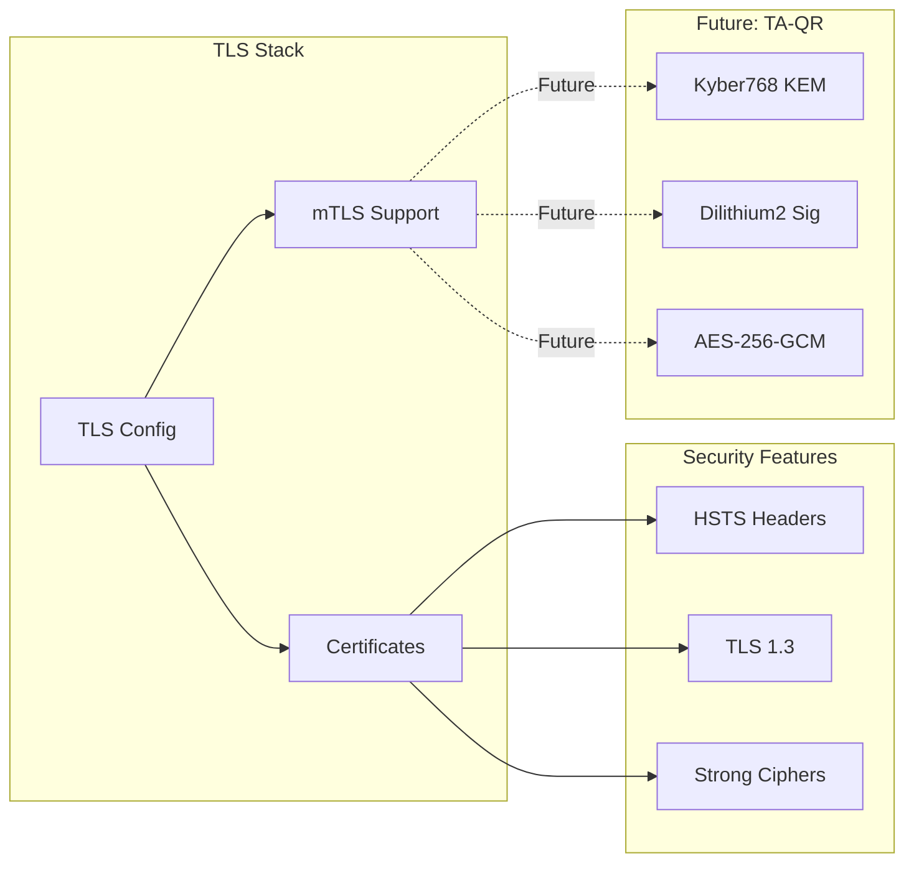

## Pagination System

### Pagination Strategies

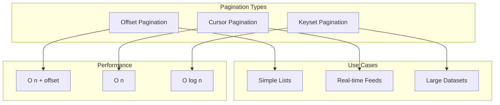

## Deployment Architecture

### Development Environment

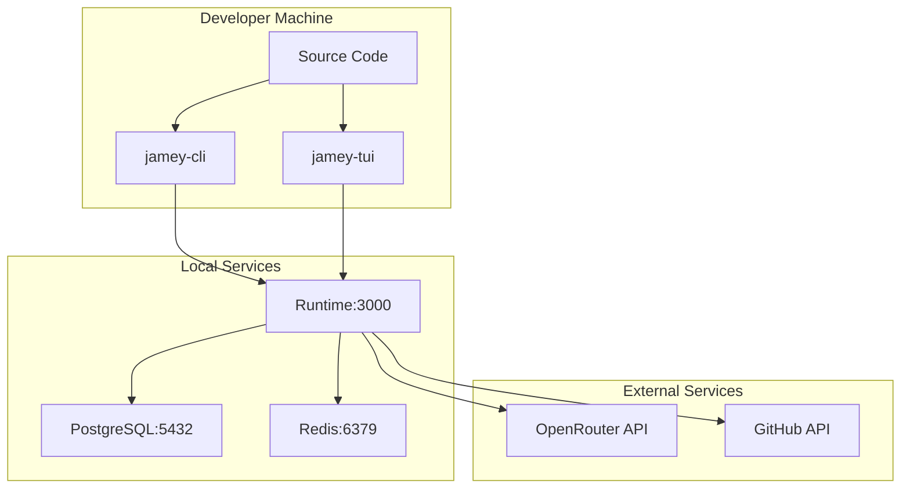

### Production Environment (Future)

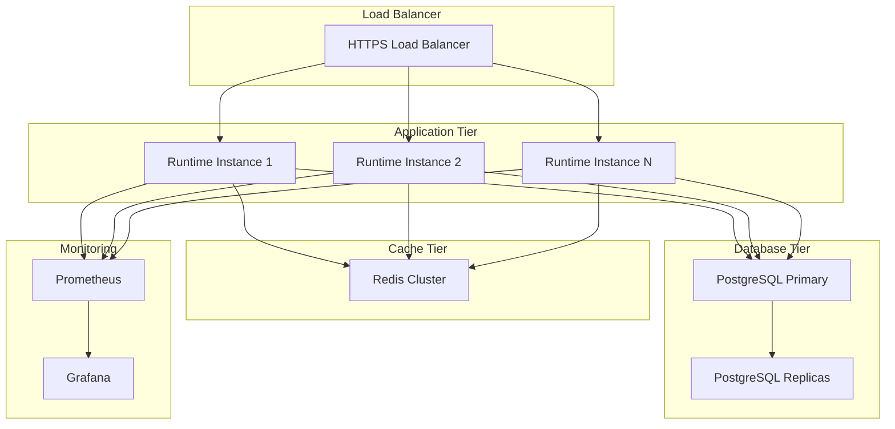

## Performance Characteristics

### Latency Targets

| Operation | Target | P95 | P99 |
|-----------|--------|-----|-----|
| Memory Retrieve (cached) | < 1ms | 2ms | 5ms |
| Memory Retrieve (uncached) | < 10ms | 20ms | 50ms |
| Vector Search (cached) | < 5ms | 10ms | 20ms |
| Vector Search (uncached) | < 50ms | 100ms | 200ms |
| LLM Response | < 2s | 5s | 10s |
| Cache Invalidation | < 1ms | 2ms | 5ms |

### Throughput Targets

| Operation | Target RPS | Notes |
|-----------|------------|-------|
| Memory Reads | 10,000+ | With caching |
| Memory Writes | 1,000+ | With batching |
| Vector Searches | 500+ | Depends on index |
| LLM Requests | 100+ | Rate limited |

### Resource Usage

| Component | Memory | CPU | Disk |
|-----------|--------|-----|------|
| jamey-runtime | 512MB | 2 cores | 10GB |
| PostgreSQL | 2GB | 4 cores | 100GB+ |
| Redis | 1GB | 1 core | 1GB |

## Scalability Considerations

### Horizontal Scaling

1. **Stateless Runtime**: Multiple runtime instances behind load balancer
2. **Shared Cache**: Redis cluster for distributed caching
3. **Database Replication**: Read replicas for query scaling
4. **Connection Pooling**: Efficient database connection management

### Vertical Scaling

1. **Memory**: Increase cache capacity for better hit rates
2. **CPU**: More cores for parallel processing
3. **Disk**: SSD for faster database operations
4. **Network**: Higher bandwidth for external API calls

## Monitoring and Observability

### Metrics

```rust
// Key metrics to track
pub struct SystemMetrics {
    // Memory metrics
    pub memory_operations_total: Counter,
    pub memory_operation_duration: Histogram,
    pub cache_hit_rate: Gauge,
    
    // LLM metrics
    pub llm_requests_total: Counter,
    pub llm_request_duration: Histogram,
    pub llm_tokens_used: Counter,
    pub llm_cost_usd: Counter,
    
    // System metrics
    pub active_connections: Gauge,
    pub error_rate: Counter,
    pub request_rate: Counter,
}
```

### Logging

- **Structured Logging**: JSON format with tracing
- **Log Levels**: DEBUG, INFO, WARN, ERROR
- **Sensitive Data**: Automatic redaction
- **Correlation IDs**: Request tracking across components

### Tracing

- **Distributed Tracing**: OpenTelemetry integration (future)
- **Span Tracking**: Per-operation timing
- **Context Propagation**: Across async boundaries

## Future Enhancements

### Short Term (3-6 months)

1. **TA-QR Crypto**: Quantum-resistant encryption
2. **Phoenix Integration**: Direct channel to Phoenix.Marie
3. **ORCH Army**: MQTT-TLS for node communication
4. **Enhanced Monitoring**: Prometheus + Grafana
5. **API Documentation**: OpenAPI/Swagger

### Medium Term (6-12 months)

1. **Multi-Model Support**: Multiple embedding models
2. **Advanced Caching**: Predictive prefetching
3. **Distributed Runtime**: Multi-node deployment
4. **GraphQL API**: Alternative to REST
5. **WebSocket Support**: Real-time updates

### Long Term (12+ months)

1. **Kubernetes Deployment**: Container orchestration
2. **Service Mesh**: Istio integration
3. **Event Sourcing**: CQRS pattern
4. **Machine Learning**: Custom model training
5. **Blockchain Integration**: Immutable audit log

## Development Guidelines

### Code Organization

```
jamey-code/
├── jamey-core/          # Core functionality
│   ├── src/
│   │   ├── memory.rs    # Memory store
│   │   ├── cache.rs     # Cache manager
│   │   ├── secrets.rs   # Secret management
│   │   └── lib.rs       # Public API
│   └── tests/           # Integration tests
├── jamey-runtime/       # Runtime engine
│   ├── src/
│   │   ├── service.rs   # HTTP service
│   │   ├── config.rs    # Configuration
│   │   └── lib.rs       # Public API
│   └── tests/
├── jamey-providers/     # LLM providers
├── jamey-tools/         # System tools
├── jamey-protocol/      # Shared types
├── jamey-cli/           # CLI interface
├── jamey-tui/           # TUI interface
└── docs/                # Documentation
    ├── adr/             # Architecture decisions
    └── *.md             # Technical docs
```

### Testing Strategy

1. **Unit Tests**: Per-module testing
2. **Integration Tests**: Cross-module testing
3. **Property Tests**: Fuzzing with proptest
4. **Load Tests**: Performance benchmarking
5. **Security Tests**: Vulnerability scanning

### CI/CD Pipeline

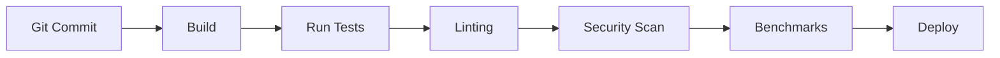

## Conclusion

Jamey 2.0 is designed as a robust, scalable, and secure digital twin system. The architecture emphasizes:

- **Modularity**: Clear separation of concerns
- **Performance**: Efficient caching and database access
- **Security**: Defense-in-depth approach
- **Extensibility**: Easy to add new features
- **Maintainability**: Well-documented and tested

This architecture provides a solid foundation for the Eternal Hive mission while remaining flexible enough to evolve with changing requirements.

## Related Documentation

- [Cache Invalidation Architecture](cache-invalidation.md) - Detailed cache strategy design
- [Configuration Architecture](configuration.md) - Granular configuration system
- [Pagination Architecture](pagination.md) - Pagination strategies
- [Improvements Summary](improvements-summary.md) - Enhancement roadmap
- [TA-QR Architecture](../security/ta-qr/architecture.md) - Quantum-resistant cryptography
- [ADR 001: Cache Invalidation](../adr/001-cache-invalidation-strategies.md) - Design decision

## References

- [Rust Async Book](https://rust-lang.github.io/async-book/)
- [PostgreSQL Documentation](https://www.postgresql.org/docs/)
- [Redis Documentation](https://redis.io/documentation)
- [OpenRouter API](https://openrouter.ai/docs)

---

**Last Updated**: 2025-11-17
**Status**: ✅ Complete
**Category**: Architecture