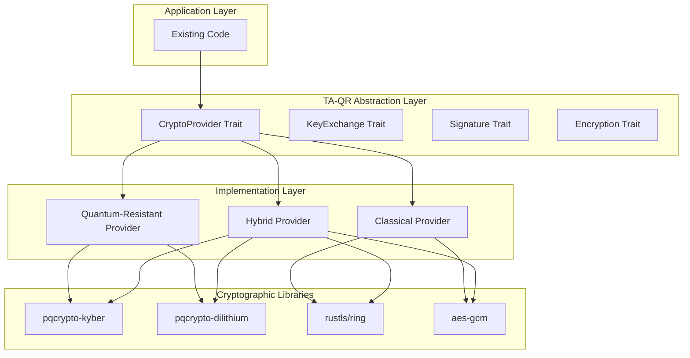

# TA-QR (Trusted Agent - Quantum Resistant) Cryptographic Architecture

> **Navigation**: [Documentation Home](../../README.md) > [Security](../README.md) > [TA-QR](README.md) > Architecture

## Overview

The TA-QR cryptographic stack provides a minimal, wrapper-based approach to quantum-resistant cryptography that allows gradual migration from classical cryptographic operations without breaking existing functionality.

## Design Principles

1. **Minimal Disruption**: Wrap existing cryptographic operations rather than replacing them
2. **Backward Compatibility**: Support both classical and quantum-resistant modes
3. **Gradual Migration**: Allow incremental adoption across the codebase
4. **Performance Awareness**: Hybrid schemes balance security with performance
5. **Future-Proof**: Designed to accommodate emerging PQC standards

## Architecture Overview



## Quantum-Resistant Algorithms

### Selected Algorithms (NIST PQC Standards)

#### 1. Key Encapsulation Mechanism (KEM)
- **Primary**: ML-KEM (Kyber) - NIST FIPS 203
  - Kyber512: ~128-bit security
  - Kyber768: ~192-bit security (recommended)
  - Kyber1024: ~256-bit security

#### 2. Digital Signatures
- **Primary**: ML-DSA (Dilithium) - NIST FIPS 204
  - Dilithium2: ~128-bit security
  - Dilithium3: ~192-bit security (recommended)
  - Dilithium5: ~256-bit security
- **Alternative**: SLH-DSA (SPHINCS+) - NIST FIPS 205
  - Stateless hash-based signatures
  - Larger signatures but conservative security

### Rust Crate Selection

| Algorithm | Crate | Version | Status | Notes |
|-----------|-------|---------|--------|-------|
| ML-KEM (Kyber) | `pqcrypto-kyber` | 0.8+ | Stable | NIST standardized |
| ML-DSA (Dilithium) | `pqcrypto-dilithium` | 0.5+ | Stable | NIST standardized |
| SLH-DSA (SPHINCS+) | `pqcrypto-sphincsplus` | 0.7+ | Stable | Conservative fallback |
| Hybrid TLS | `rustls-post-quantum` | 0.1+ | Experimental | For future TLS integration |

## Module Structure

```
jamey-core/src/
├── crypto/
│   ├── mod.rs              # Public API and re-exports
│   ├── traits.rs           # Core trait definitions
│   ├── classical.rs        # Classical crypto implementations
│   ├── quantum_resistant.rs # PQC implementations
│   ├── hybrid.rs           # Hybrid classical/PQC
│   ├── config.rs           # Configuration types
│   └── error.rs            # Error types
├── secrets_qr.rs           # Quantum-resistant secret manager
└── tls_qr.rs              # Future: Quantum-resistant TLS wrapper
```

## Core Traits

### CryptoProvider Trait

```rust
pub trait CryptoProvider: Send + Sync {
    /// Get the cryptographic mode (Classical, QuantumResistant, Hybrid)
    fn mode(&self) -> CryptoMode;
    
    /// Get key exchange implementation
    fn key_exchange(&self) -> Arc<dyn KeyExchange>;
    
    /// Get signature implementation
    fn signature(&self) -> Arc<dyn Signature>;
    
    /// Get encryption implementation
    fn encryption(&self) -> Arc<dyn Encryption>;
    
    /// Check if this provider is quantum-resistant
    fn is_quantum_resistant(&self) -> bool;
}
```

### KeyExchange Trait

```rust
pub trait KeyExchange: Send + Sync {
    /// Generate a new keypair
    fn generate_keypair(&self) -> Result<(PublicKey, PrivateKey)>;
    
    /// Encapsulate a shared secret (KEM)
    fn encapsulate(&self, public_key: &PublicKey) -> Result<(Ciphertext, SharedSecret)>;
    
    /// Decapsulate a shared secret (KEM)
    fn decapsulate(&self, private_key: &PrivateKey, ciphertext: &Ciphertext) 
        -> Result<SharedSecret>;
    
    /// Get algorithm identifier
    fn algorithm(&self) -> &str;
}
```

### Signature Trait

```rust
pub trait Signature: Send + Sync {
    /// Generate a signing keypair
    fn generate_keypair(&self) -> Result<(PublicKey, PrivateKey)>;
    
    /// Sign a message
    fn sign(&self, private_key: &PrivateKey, message: &[u8]) -> Result<Vec<u8>>;
    
    /// Verify a signature
    fn verify(&self, public_key: &PublicKey, message: &[u8], signature: &[u8]) 
        -> Result<bool>;
    
    /// Get algorithm identifier
    fn algorithm(&self) -> &str;
}
```

## Hybrid Cryptography Strategy

### Hybrid Key Exchange

Combines classical ECDH with ML-KEM (Kyber):

```
Shared Secret = KDF(ECDH_Secret || Kyber_Secret)
```

**Benefits**:
- Security if either algorithm is broken
- Gradual transition path
- Performance optimization opportunities

### Hybrid Signatures

Combines classical ECDSA with ML-DSA (Dilithium):

```
Signature = (ECDSA_Sig, Dilithium_Sig)
Verify = ECDSA_Verify(msg) AND Dilithium_Verify(msg)
```

**Benefits**:
- Backward compatibility with classical verifiers
- Future-proof against quantum attacks
- Flexible verification policies

## Integration Points

### 1. Secret Management

Wrap existing [`SecretManager`](../jamey-core/src/secrets.rs:27) with quantum-resistant encryption:

```rust
pub struct QrSecretManager {
    inner: SecretManager,
    crypto_provider: Arc<dyn CryptoProvider>,
    mode: CryptoMode,
}
```

**Migration Path**:
- Phase 1: Dual-store secrets (classical + QR)
- Phase 2: Verify QR decryption works
- Phase 3: Remove classical storage

### 2. TLS Configuration

Extend [`TlsConfig`](../jamey-runtime/src/tls.rs:36) with quantum-resistant options:

```rust
pub struct TlsConfig {
    // ... existing fields ...
    pub enable_pqc: bool,
    pub pqc_mode: PqcMode, // Hybrid, PureQuantum
    pub kyber_level: KyberSecurityLevel,
}
```

**Migration Path**:
- Phase 1: Add PQC support alongside classical TLS
- Phase 2: Enable hybrid mode by default
- Phase 3: Deprecate classical-only mode

### 3. Database Encryption

Enhance PostgreSQL encryption with quantum-resistant keys:

```rust
// Encrypt sensitive columns with QR keys
let encrypted = qr_provider.encrypt(data, &public_key)?;
```

## Configuration

### Environment Variables

```bash
# Enable TA-QR cryptography
CRYPTO_MODE=hybrid  # classical, quantum_resistant, hybrid

# Key exchange algorithm
CRYPTO_KEM_ALGORITHM=kyber768  # kyber512, kyber768, kyber1024

# Signature algorithm
CRYPTO_SIG_ALGORITHM=dilithium3  # dilithium2, dilithium3, dilithium5

# Migration settings
CRYPTO_ENABLE_DUAL_STORAGE=true
CRYPTO_VERIFY_CLASSICAL=true
```

### Runtime Configuration

```rust
pub struct CryptoConfig {
    pub mode: CryptoMode,
    pub kem_algorithm: KemAlgorithm,
    pub sig_algorithm: SigAlgorithm,
    pub enable_dual_storage: bool,
    pub verify_classical: bool,
}
```

## Migration Strategy

### Phase 1: Foundation (Weeks 1-2)
- [ ] Add TA-QR dependencies to Cargo.toml
- [ ] Implement core traits and interfaces
- [ ] Create classical provider (wraps existing crypto)
- [ ] Add configuration infrastructure
- [ ] Write unit tests for traits

### Phase 2: Quantum-Resistant Implementation (Weeks 3-4)
- [ ] Implement ML-KEM (Kyber) key exchange
- [ ] Implement ML-DSA (Dilithium) signatures
- [ ] Create quantum-resistant provider
- [ ] Add integration tests
- [ ] Performance benchmarking

### Phase 3: Hybrid Implementation (Weeks 5-6)
- [ ] Implement hybrid key exchange
- [ ] Implement hybrid signatures
- [ ] Create hybrid provider
- [ ] Add comprehensive tests
- [ ] Security audit preparation

### Phase 4: Integration (Weeks 7-8)
- [ ] Wrap SecretManager with QR support
- [ ] Add dual-storage mode
- [ ] Update TLS configuration
- [ ] Create migration tools
- [ ] Documentation and examples

### Phase 5: Migration & Validation (Weeks 9-10)
- [ ] Enable hybrid mode in development
- [ ] Validate backward compatibility
- [ ] Performance testing
- [ ] Security review
- [ ] Production rollout plan

## Backward Compatibility

### Key Principles

1. **No Breaking Changes**: Existing code continues to work
2. **Opt-In Migration**: Features enabled via configuration
3. **Dual Operation**: Support both classical and QR simultaneously
4. **Graceful Degradation**: Fall back to classical if QR unavailable

### Compatibility Matrix

| Component | Classical | Hybrid | Pure QR | Notes |
|-----------|-----------|--------|---------|-------|
| Secret Storage | ✅ | ✅ | ✅ | Dual-store during migration |
| TLS | ✅ | ✅ | ⚠️ | Hybrid recommended |
| Database Encryption | ✅ | ✅ | ✅ | Column-level migration |
| API Authentication | ✅ | ✅ | ✅ | JWT with QR signatures |

## Performance Considerations

### Algorithm Performance (Approximate)

| Operation | Classical (ECDH/ECDSA) | ML-KEM (Kyber768) | ML-DSA (Dilithium3) |
|-----------|------------------------|-------------------|---------------------|
| Keygen | ~0.1ms | ~0.05ms | ~0.2ms |
| Sign/Encap | ~0.2ms | ~0.1ms | ~1.5ms |
| Verify/Decap | ~0.3ms | ~0.15ms | ~0.5ms |
| Key Size | 32 bytes | 1184 bytes | 1952 bytes |
| Signature/CT Size | 64 bytes | 1088 bytes | 2701 bytes |

### Optimization Strategies

1. **Caching**: Cache keypairs and shared secrets
2. **Batching**: Batch signature operations
3. **Hybrid Mode**: Use classical for performance-critical paths
4. **Lazy Loading**: Load QR libraries only when needed

## Security Considerations

### Threat Model

**Protected Against**:
- Quantum computer attacks (Shor's algorithm)
- Harvest-now-decrypt-later attacks
- Classical cryptanalysis

**Not Protected Against**:
- Side-channel attacks (requires additional hardening)
- Implementation bugs (requires auditing)
- Key compromise (requires key rotation)

### Security Best Practices

1. **Key Rotation**: Rotate keys regularly (90 days recommended)
2. **Secure Storage**: Use hardware security modules when available
3. **Audit Logging**: Log all cryptographic operations
4. **Constant-Time Operations**: Prevent timing attacks
5. **Memory Zeroization**: Clear sensitive data from memory

## Testing Strategy

### Unit Tests
- Test each trait implementation independently
- Verify algorithm correctness
- Test error handling

### Integration Tests
- Test provider switching
- Verify backward compatibility
- Test migration scenarios

### Performance Tests
- Benchmark all operations
- Compare classical vs QR vs hybrid
- Identify bottlenecks

### Security Tests
- Fuzz testing
- Side-channel analysis
- Penetration testing

## Monitoring and Observability

### Metrics to Track

```rust
pub struct CryptoMetrics {
    pub operations_total: Counter,
    pub operation_duration: Histogram,
    pub errors_total: Counter,
    pub key_rotations: Counter,
    pub mode_switches: Counter,
}
```

### Logging

```rust
tracing::info!(
    algorithm = %self.algorithm(),
    mode = ?self.mode(),
    duration_ms = %duration.as_millis(),
    "Cryptographic operation completed"
);
```

## Future Enhancements

### Short Term (3-6 months)
- [ ] Add SPHINCS+ as signature alternative
- [ ] Implement key rotation automation
- [ ] Add hardware acceleration support
- [ ] Create admin dashboard for crypto status

### Medium Term (6-12 months)
- [ ] Full post-quantum TLS support
- [ ] Zero-knowledge proof integration
- [ ] Homomorphic encryption for database
- [ ] Multi-party computation primitives

### Long Term (12+ months)
- [ ] Quantum key distribution (QKD) integration
- [ ] Lattice-based fully homomorphic encryption
- [ ] Post-quantum secure multi-party computation
- [ ] Quantum-resistant blockchain integration

## References

## Related Documentation

- [TA-QR Overview](README.md) - Introduction and quick reference
- [Implementation Specification](implementation-spec.md) - Technical implementation details
- [Usage Guide](usage-guide.md) - Migration guide and usage patterns
- [Security Overview](../README.md) - Overall security architecture
- [TLS Configuration](../tls-configuration.md) - TLS setup

### Standards
- [NIST FIPS 203: ML-KEM](https://csrc.nist.gov/pubs/fips/203/final)
- [NIST FIPS 204: ML-DSA](https://csrc.nist.gov/pubs/fips/204/final)
- [NIST FIPS 205: SLH-DSA](https://csrc.nist.gov/pubs/fips/205/final)

### Libraries
- [pqcrypto](https://github.com/rustpq/pqcrypto)
- [oqs-rs](https://github.com/open-quantum-safe/liboqs-rust)
- [rustls](https://github.com/rustls/rustls)

### Research
- [NIST Post-Quantum Cryptography](https://csrc.nist.gov/projects/post-quantum-cryptography)
- [Open Quantum Safe](https://openquantumsafe.org/)
- [PQShield](https://pqshield.com/)

---

**Last Updated**: 2025-11-17
**Status**: 📝 Design Complete
**Category**: Security / Cryptography

## Appendix A: Algorithm Selection Rationale

### Why ML-KEM (Kyber)?
- NIST standardized (FIPS 203)
- Excellent performance
- Small key/ciphertext sizes
- Strong security proofs
- Wide industry adoption

### Why ML-DSA (Dilithium)?
- NIST standardized (FIPS 204)
- Good performance
- Reasonable signature sizes
- Strong security guarantees
- Suitable for general use

### Why Hybrid Mode?
- Defense in depth
- Smooth migration path
- Backward compatibility
- Risk mitigation
- Industry best practice

## Appendix B: Key Size Comparison

| Algorithm | Public Key | Private Key | Signature/Ciphertext |
|-----------|------------|-------------|----------------------|
| ECDSA P-256 | 32 B | 32 B | 64 B |
| RSA-2048 | 256 B | 256 B | 256 B |
| Kyber512 | 800 B | 1632 B | 768 B |
| Kyber768 | 1184 B | 2400 B | 1088 B |
| Kyber1024 | 1568 B | 3168 B | 1568 B |
| Dilithium2 | 1312 B | 2528 B | 2420 B |
| Dilithium3 | 1952 B | 4000 B | 3293 B |
| Dilithium5 | 2592 B | 4864 B | 4595 B |

## Appendix C: Glossary

- **KEM**: Key Encapsulation Mechanism
- **ML-KEM**: Module-Lattice-Based KEM (Kyber)
- **ML-DSA**: Module-Lattice-Based Digital Signature Algorithm (Dilithium)
- **SLH-DSA**: Stateless Hash-Based Digital Signature Algorithm (SPHINCS+)
- **PQC**: Post-Quantum Cryptography
- **QR**: Quantum-Resistant
- **TA-QR**: Trusted Agent - Quantum Resistant